# 高级软件工程课程实践02实验报告

http://10.176.122.1:12138/api/v1/student


## 1 项目实现

本次项目实现使用JAVA，构建工具使用Maven，框架使用Spring Boot。


### 1.1 项目结构

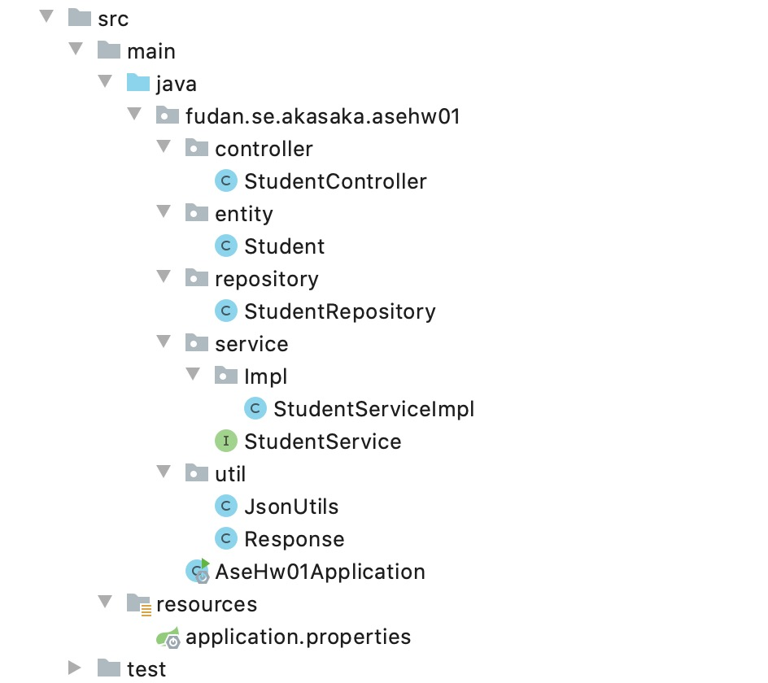


### 1.2 项目具体实现

项目不涉及持久层，使用内存缓存数据：

```java
private List<Student> students = new ArrayList<>();

public StudentRepository() {
    initStudents();
}

private void initStudents() {
    students.add(new Student("01", "test01", "testDep01", "testMaj01"));
    students.add(new Student("02", "test02", "testDep02", "testMaj02"));
    students.add(new Student("03", "test03", "testDep03", "testMaj03"));
    students.add(new Student("04", "test04", "testDep04", "testMaj04"));
}
```

以API添加学生为例演示项目各API的具体实现。

#### Controller

```java
@Resource
private StudentService studentService;

@PostMapping("/api/v1/student")
@ResponseBody
public String createStudent(@RequestBody Student student) {
    Response response = studentService.createStudent(student);
    int status = response.getStatus();
    if (status == 0)
        return response.getMsg();
    else if (status == 1)
        return response.getMsg();
    else return "Unknown error";
}
```


#### Service

```java
private StudentRepository studentRepository=new StudentRepository();
    
@Override
public Response createStudent(Student student) {
    if (studentRepository.save(student) == null)
        return new Response<Student>(0, "Student already exit", student);
    return new Response<Student>(1, success, student);
}
```


#### Repository

```java
/**
 * 添加学生
 *
 * @param student
 */
public Student save(Student student) {
    for (Student tempStudent : students) {
        if (tempStudent.getStudentId().equals(student.getStudentId())) {
            return null;
        }
    }
    students.add(student);
    return student;
}
```


### 1.3 项目部署

项目使用docker部署在远程服务器，服务器IP为`10.176.122.1`，访问容器的12138端口即可访问项目。下面是构建镜像时所用的Dockerfile，父镜像是JAVA8镜像。

```dockerfile
FROM java:8-jre

RUN /bin/cp /usr/share/zoneinfo/Asia/Shanghai /etc/localtime && echo 'Asia/Shanghai' >/etc/timezone

ADD ./target/ase-hw01-0.0.1-SNAPSHOT.jar /app/
CMD ["java", "-Xmx200m", "-jar", "/app/ase-hw01-0.0.1-SNAPSHOT.jar"]

EXPOSE 12138
```

运行容器时，docker run命令将服务器的12138端口对应容器的12138端口，访问服务器的12138端口`10.176.122.1:12138`即可访问项目。


## 2 实验结果

项目被部署服务器`10.176.122.1`，用不同http方法访问 http://10.176.122.1:12138/api/v1/student 即可访问CRUD 四个API。

测试工具使用Postman。

### 2.1 查询所有学生


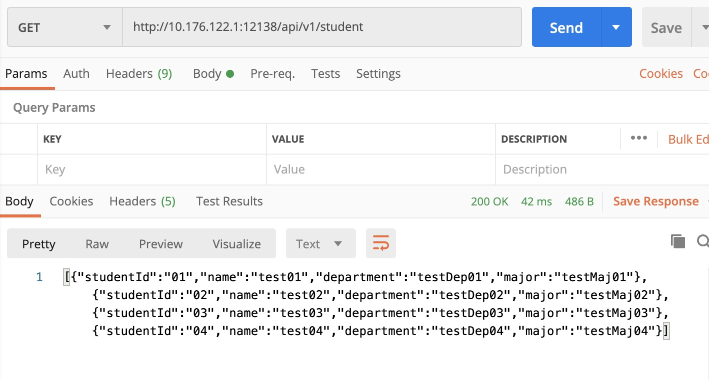


### 2.2 添加学生

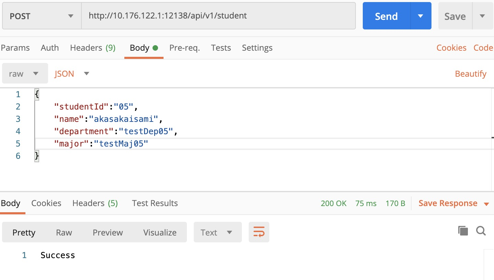

添加后查询结果

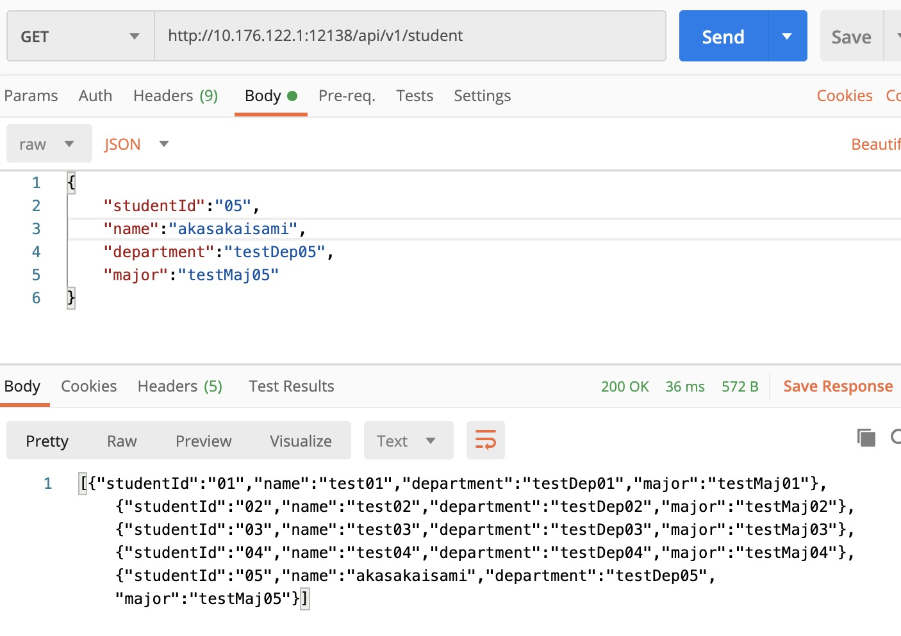

添加已经存在的学生

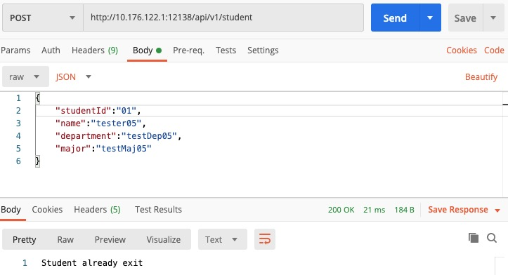


### 2.3 更新学生信息

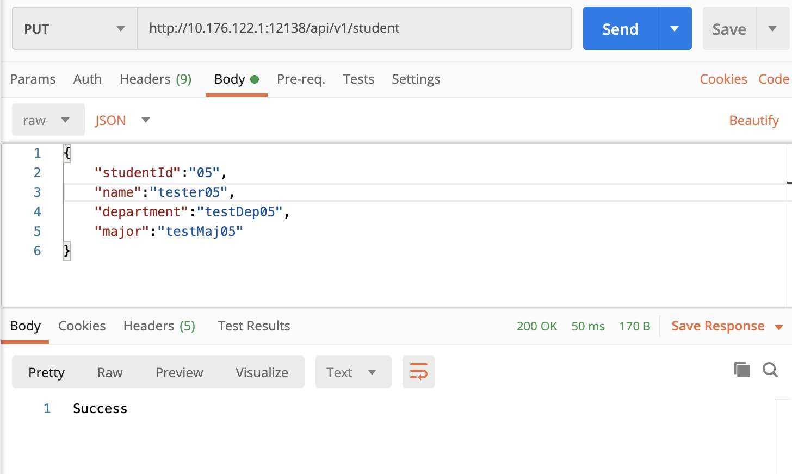

更新后查询结果

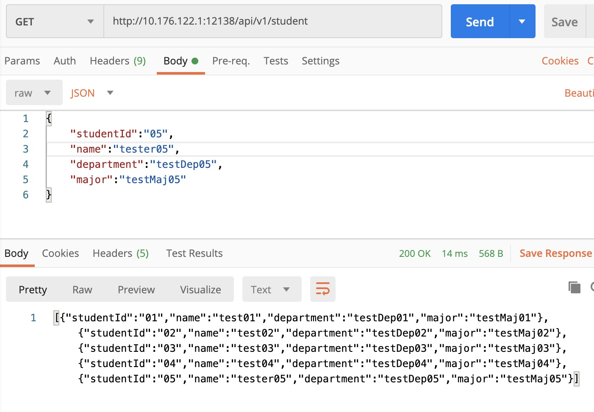

更新不存在的学生

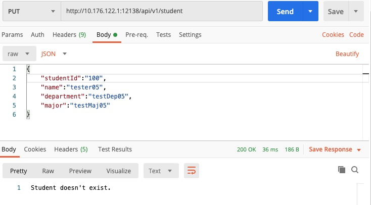


### 2.4 删除学生

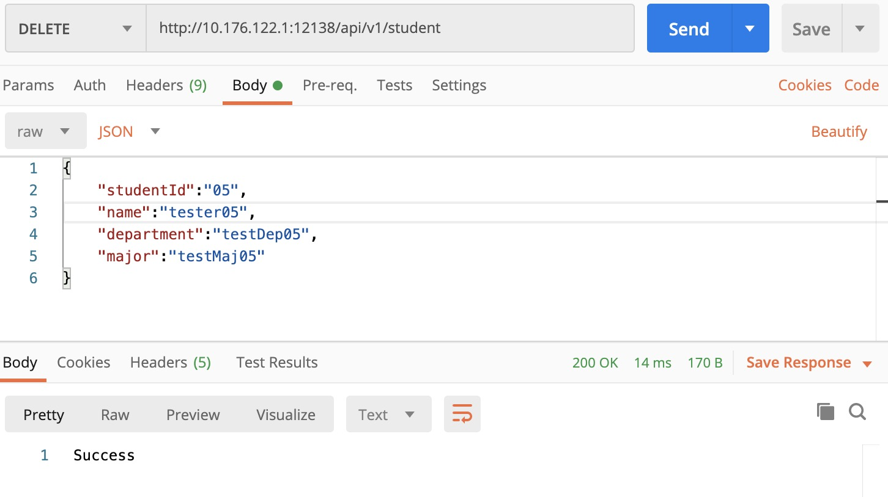


删除后查询结果

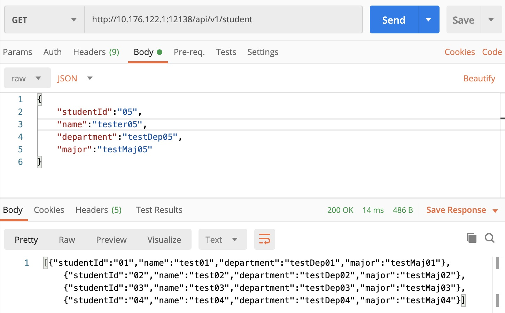


删除不存在的学生

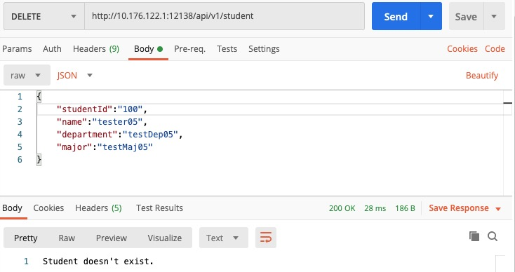

